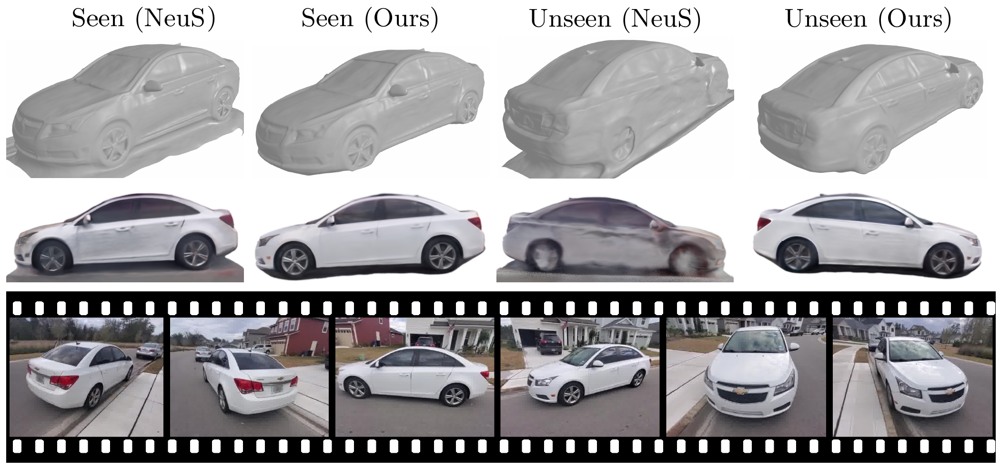
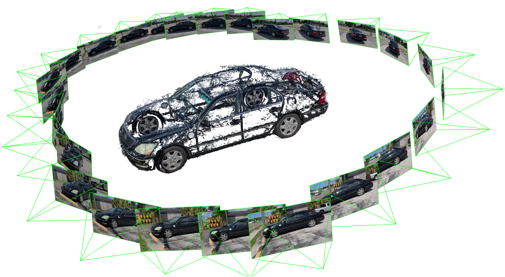

# SNeS: Learning Probably Symmetric Neural Surfaces from Incomplete Data

Eldar Insafutdinov*, Dylan Campbell*, Joao F Henriques and Andrea Vedaldi. *ECCV 2022*

[Paper](https://arxiv.org/abs/2206.06340)



## Setup

Create a conda environment with python 3.9, pytorch 1.11 for CUDA 11.3 and pytorch3d 0.6.2:

```shell
conda env create -f environment.yml
```

## Dataset

Download a CO3D car category (or others) [here](https://ai.facebook.com/datasets/co3d-downloads/) and extract to `data/` such that it is organised like so:

```
data/co3d
|-- car
    |-- <scene_id>
        |-- images
        |-- masks
        |-- depths
        |-- depth_masks
    ...
|-- toyplane
...
```

Extract 3D bounding box fits for selected categories:

```shell
cd data; tar xzvf co3d_extra_data.tar.gz; cd ..
```

## Training

Run the following command to train the model on a single scene using the structured train/val split as described in the paper:

```shell
(EXP=car/structured ID=157_17286_33548; python exp_runner.py gpu=0 mode=train config.file=exp/$EXP/config.yaml config.exp_name=$EXP/${ID} dataset.instance=\'$ID\')
```

Training logs and model checkpoints of this run will be saved under `exp/car/structured/157_17286_33548`. In order to reproduce the results in the paper repeat the command above for every scene listed in `lists/co3d_car_structured_split.txt`.

Similarly, to train a model on the official CO3D split replace `car/structured` with `car/official` in the command above.

## Test and evaluate

Render test views:

```shell
python scripts/render_nvs_predictions.py --gpu=0 --exp=car/structured --instance=157_17286_33548
```

Evaluate:

```
python scripts/evaluate.py --gpu=0 --exp=car/structured
```

## Visualisation

### Extract and display 3D mesh

First run the following script:

```shell
python exp_runner.py gpu=0 mode=visualise_mesh test.web_vis=true config.exp_name=car/structured/157_17286_33548 visualisation.port=8888
```

And then open the link in the browser http://localhost:8888.

### Show epipolar lines

Use the notebook `scripts/vis_epipolar.ipynb` for interactive epipolar line visualisation. Click on anywhere in the left image and the corresponding epipolar line on the right will be shown

### Visualise cameras

<!--  -->


Use `scripts/vis_cameras.py` (script adapted from [NeRF++](https://github.com/Kai-46/nerfplusplus)) to visualise cameras.

## Citation

If you find this work useful consider citing our paper:

```
@article{insafutdinov2022snes,
  title={SNeS: Learning Probably Symmetric Neural Surfaces from Incomplete Data},
  author={Insafutdinov, Eldar and Campbell, Dylan and Henriques, Jo{\~a}o F and Vedaldi, Andrea},
  journal={arXiv preprint arXiv:2206.06340},
  year={2022}
}
```

## Acknowledgement

The starting point for this project was the implementation of [NeuS](https://github.com/Totoro97/NeuS). We thank the authors of this excellent paper.
